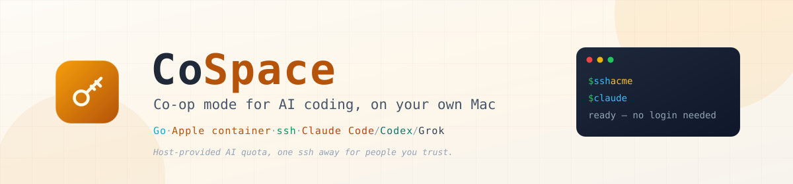
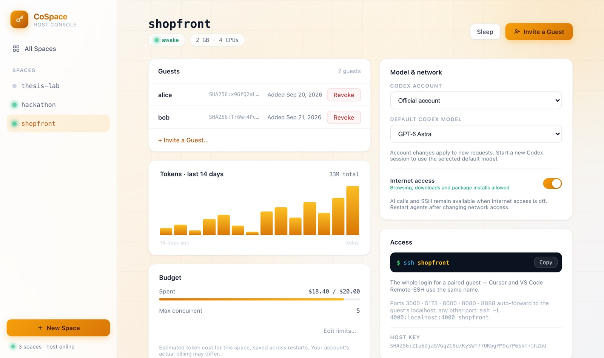
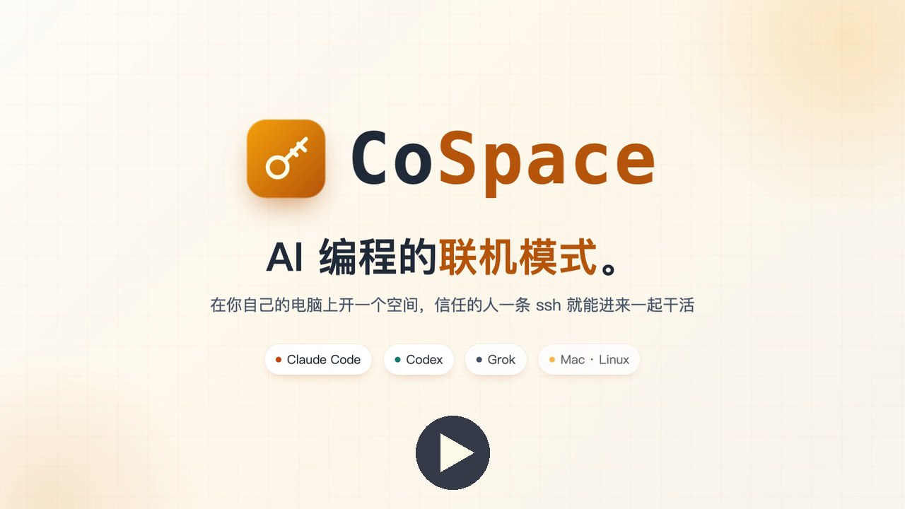

<div align="center">



# CoSpace — AI 编程的联机模式。


[English](README.md) | **简体中文**

</div>

---

CoSpace 是一个 macOS 常驻程序加一个单文件 guest 命令行工具，把你 Mac 上的算力和 AI 订阅变成可共享的 Linux 开发空间。它给需要在同一个地方干活的开发者和 coding agent——同一份文件、同一批 Claude Code session、同一份 memory；也给想把「开箱即用的 agent 环境」交到信任的人手里的 host——对方零注册、零 API key、零云账单。

每个空间是 host Mac 上的一个 Linux VM（Apple container）。guest 用标准 `ssh` 进入；空间里的 `claude`、`codex`、`grok` 经 Mac 上的凭证网关已处于登录态。真凭证永不进入空间——空间里只有一个可随时撤销的假 token。



## 演示视频

[](https://github.com/JingxuanKang/cospace/releases/download/v0.4.0/cospace-promo.mp4)

66 秒演示：一条命令装好 host、两下点击发出邀请、guest 一分钟内用上 Claude Code、两个人实时看到同一个 agent 会话。

## 安装

**Mac host**——Apple Silicon 的 Mac，macOS 26 或更新。一条命令：

```bash
curl -fsSL https://jingxuankang.github.io/cospace/host.sh | sh
```

它会装好 Apple `container`（有 Homebrew 就用 brew，否则用 Apple 签名安装包）、下载预编译的 `cospaced`、注册为登录自启服务，并打开控制台 `http://127.0.0.1:18931`。首次运行时 daemon 会在后台下载一次空间镜像（约 600 MB），控制台显示进度；之后每个新空间几秒就开好。重复执行即原地升级；`cospaced uninstall` 只移除服务、保留空间。想给空间用哪家 AI，就在这台 Mac 上登录对应的 `claude`、`codex` 或 `grok`。

**Linux host**——x86_64 或 arm64，装好 Docker Engine（当前用户免 `sudo` 可用）和 systemd。同一条命令会把 `cospaced` 装成 systemd 用户服务，以 Docker 作为空间运行时。控制台只监听服务器本机：用 `ssh -L 18931:127.0.0.1:18931 <服务器>` 或经 Tailscale 访问；AI CLI 在服务器上登录（无界面可用设备码登录）。

**Guest**——一条命令、无需账号（装上 `cospace`，附 `co` 别名）：

```bash
curl -fsSL https://jingxuankang.github.io/cospace/install.sh | sh     # macOS / Linux
irm https://raw.githubusercontent.com/JingxuanKang/cospace/master/docs/install.ps1 | iex          # Windows PowerShell（需系统 OpenSSH Client；已交叉编译，尚未在真机验证）
```

同一条命令也是更新命令：已装 `cospace` 的机器上，版本与发布版一致就直接退出，否则原地替换（Homebrew 安装的——`brew install jingxuankang/tap/cospace`——交给 `brew upgrade`）。已有工具的 guest 直接 `cospace pair`；如果版本太旧，配对会提示并指向安装命令。`cospace version` 查看版本。

所有下载都托管在 GitHub——安装脚本在 GitHub Pages、程序在 Releases、空间镜像在 ghcr.io——不需要运营任何下载服务器。

## 快速开始

在控制台里：**New Space** → 起个名字 → **Invite a Guest**，把邀请链接（或弹窗里的三行命令）发给 guest。对方粘贴一次，之后：

```bash
ssh acme        # 进来了——claude / codex / grok 直接可用
```

也可以用 CLI：`cospaced space create acme`，再用 `cospaced invite acme` 打印要发的命令。

## 同一个空间，人和 agent 都在

Claude Code 的 session 和 memory 就是家目录里的普通文件，所以共享同一个 home 本身就是协作层——不需要在上面再造任何产品功能。

| 你想 | 你做 |
|---|---|
| 看同事的 agent 跑了什么 | `claude --resume` 列出所有人的 session |
| 对方睡觉时接手 | 带完整上下文 resume 对方的 session |
| 现场围观 / 结对 | `tmux attach` |
| commit 归属不乱 | 每位 guest 的密钥登录时带上 `SPACE_MEMBER`，git author / committer 默认就是这个名字，guest 自己设过的不动 |

## 一分钟用上 Claude Code

guest 不注册、不装 IDE、不碰 API key——空间已经用 host 自己的账号预认证好。主动权始终在 host：每空间美元上限与并发上限（超限请求得到干净的 429）、每空间 AI 开关、全局总闸、以及点下即生效的成员撤销。用量走你的订阅和它的 rate limit，所以只邀请你信任的人。

你不在时空间也保持登录态：provider 的 token 只活数小时，daemon 会盯着它们的过期时间，在失效前用最便宜的模型对各家 CLI 发一次极小请求触发官方续期。

## Full-auto 空间

新空间默认 full-auto：`claude` 使用 `bypassPermissions`，`codex` 使用 `approval_policy = "never"`。Agent 在独立 VM 内以普通 space 用户运行，受每空间预算和并发限制；它能修改空间内共享的文件，Host 账号真凭证始终留在空间外。

控制台按空间开关（"AI in this space" → Full-auto agents）。休眠时的配置变更保存后在唤醒时应用；运行中的配置应用失败会恢复旧设置。

## 模型与联网

空间详情的 **Model & network** 卡片选择 Codex 账号（官方、可选的 Sub2API I / II）及默认模型（GPT-6 Astra、GPT-5.6 Sol/Terra/Luna）。账号切换影响后续请求，默认模型在新 Codex 会话中生效。Sub2API 真 key 留在 Host 的 Keychain，配置方法见 [Deploy.md](Deploy.md)。

**Internet access** 默认开启。关闭后限制 IPv4/IPv6 出站，只保留 AI 网关和入站连接的回复，SSH 仍可用；网关同时拒绝云端搜索、远端 MCP 和远程媒体 URL。本地工具和内联图片仍可使用。休眠空间须先唤醒再改此开关，网络权限改变后请重开 agent 会话。

旧空间通过 **Enable network controls…** 一次性升级：保存完整文件系统快照，保留 workspace、已装工具与 SSH 身份，然后重启 VM；运行中的程序会停止。刷新控制台后仍可查看升级进度。

## 模板与预算

把一个空间的配置——尺寸、AI 选装、账号与模型、联网设置、预算、full-auto——存成命名模板（空间详情页 "Save as Template"），之后在新建空间弹窗或 `cospaced space create -template <名字>` 一键复制。美元额度使用 token 成本估算，不等同于账号实际账单。

## 架构

```
guest：标准 ssh / Cursor Remote SSH
   │
   ├─ tailcat（内嵌 Tailscale 库：P2P 直连，DERP 兜底）   ── 双方零服务器
   └─ host 自己的 VPS 中转（哑加密管道）                  ── 实验性：已实现并测试，`cospaced serve` 尚不能选用
   ▼
Mac 上的 cospaced ── 凭证网关（换 token + 计量 + 限额）
   ▼                  Web 控制台（go:embed，vanilla JS）
Apple container：每空间一个 Linux VM + 持久卷
```

产品方不运营任何服务：连接要么点对点、要么走 host 自己的 VPS。完整设计见 [DESIGN.md](DESIGN.md)。

## 安全

- 真 OAuth/API token 只存在于 Mac 上的网关进程；空间只持有每空间假 token，边缘换头、即时可撤销。
- 空间看不到 Mac 的家目录、其它空间、host 的 git/ssh 身份；每空间独立 ED25519 host key，由 guest 工具固定在专用受管 `known_hosts` 里。
- host 能看到空间内的一切——空间是协作空间，不是对 host 保密的私有 VM。guest 消耗的是 host 的额度；这两点都是设计使然并且明说。
- VPS 中转（实验性，尚未接入 `cospaced serve`）只转发加密的 SSH 字节，仅见连接元数据。其控制通道尚未做 TLS 固定，见 DESIGN.md §14。
- 控制台拒绝跨站写请求和非预期的 Host 头。经隧道发布到公网时要加 `cospaced serve -console-hosts <域名>`；网关默认只应答 loopback 与容器网段，其他来源需 `-gateway-allow`。

## 开发

```bash
go build ./... && go test ./...       # 全部包，无需 root
scripts/publish-image.sh --build      # 本地构建空间镜像
go run ./cmd/cospaced -image ghcr.io/jingxuankang/cospace-base:1 serve
./scripts/smoke.sh                    # 真机端到端（会建一个空间再删掉）
```

Go 1.26；控制台前端是单个零依赖 HTML，`go:embed` 进 daemon 二进制。发版：提 `VERSION` 后运行 `scripts/release.sh`；镜像有改动：提 `internal/dist` 里的 tag 后运行 `scripts/publish-image.sh`（见 [Deploy.md](Deploy.md)）。

## 许可证

[MIT](LICENSE)。

## 友情链接

[](https://linux.do)
